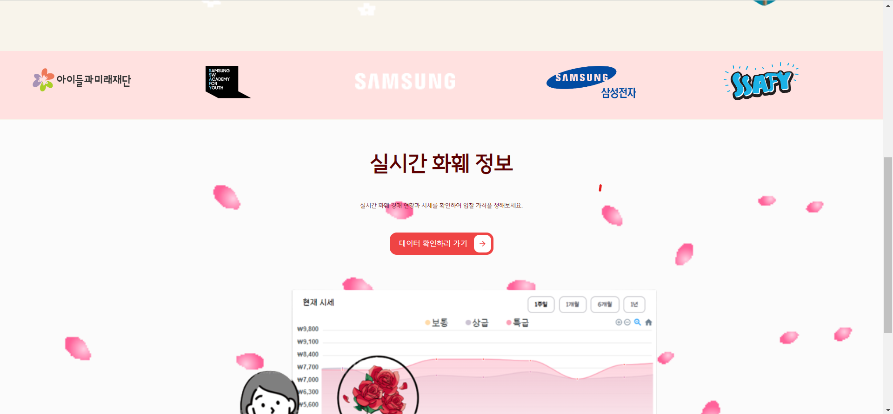

# 🌹꽃향기

<div align="center">
 <span style="font-size: xx-large; justify-items: center" >실시간 화훼 경매 시스템</span>
</div>

---

# 🎬UCC
[](https://youtu.be/yVuPLKurLtI)

※ 이미지 클릭시 UCC youtube 이동 

# 🌻서비스 소개

꽃향기는 화훼 경매에 참여하는 도매상들을 위한 실시간 온라인 화훼 경매 서비스 입니다.

집에서 간편하게 꽃을 보고 구매하세요.

# 🌼프로젝트 소개

- 진행 기간 : 2023.07.10 ~ 2023.08.18

### 📂 저장소

- **[🔎 Front-end 저장소](./kkoch)**
- **[🔎 Back-end 저장소(관리자 서버)](./admin)**
- **[🔎 Back-end 저장소(회원 서버)](./user)**
- **[🔎 Back-end 저장소(경매 서버)](./auction)**

## 주요 기능

| 기능        | 내용                                                                                                           |
|-----------|--------------------------------------------------------------------------------------------------------------|
| 경매품 관리 기능 | 관리자는 경매 일정과 경매품을 등록하고 경매방을 열 수 있습니다.<br/>새로운 화훼를 등록하고 조회할 수 있습니다.                                            |
| 경매 기능     | 회원들은 실시간으로 진행되는 화상 경매에 참여하여 원하는 꽃을 낙찰받고 마이페이지에서 확인할 수 있습니다.                                                  |
| 경매 실적 조회  | 누구나 실시간으로 업데이트 되는 낙찰된 경매품의 등급과 가격을 조회할 수 있습니다.<br/>꽃과 등급을 선택하여 기간별로 꽃을 조회할 수 있습니다.<br/>꽃과 등급별로 낙찰 동계를 제공합니다. |

## 기술 스택

### Front-end

|  |  |  |
|:-----------------------------------------------------------------------------------------------------------------------------------------------------------------------------------------------------------------------------------------:|:--------------------------------------------------------------------------------------------------------------------------------------------------------------------------------------------------------------------------------------:|:---------------------------------------------------------------------------------------------------------------------------------------------------------------------------------------------------------------------------------------------:|
|                                                                                                                   HTML5                                                                                                                   |                                                                                                                  CSS3                                                                                                                  |                                                                                                                  TypeScript                                                                                                                   |

|  |  |  |
|:------------------------------------------------------------------------------------------------------------------------------------------------------------------------------------------------------------------------------------------:|:---------------------------------------------------------------------------------------------------------------------------------------------------------:|:---------------------------------------------------------------------------------------------:|
|                                                                                                                   React                                                                                                                    |                                                                           Redux                                                                           |                                             Vite                                              |

|  |  |  |
|:--------------------------------------------------------------------------------:|:------------------------------------------------------------------------------------:|:------------------------------------------------------------------------------------------------:|
|                                    WebSocket                                     |                                         MUI                                          |                                           Tailwind CSS                                           |

### Back-end

|  |  |  |
|:-----------------------------------------------------------------------------------------------------------------------------------------------------------------------:|:----------------------------------------------------------------------------------------------------------------------------------------------------------:|:----------------------------------------------------------------------------------------------:|
|                                                                                  Java                                                                                   |                                                                         SpringBoot                                                                         |                                          SpringCloud                                           |

|  |  |  |  |
|:--------------------------------------------------------------------------------------------------------------------------------------:|:------------------------------------------------------------------------------------------------------------------------------------------------------------------------:|:-----------------------------------------------------------------------------------------------------------------------:|:----------------------------------------------------------------------------------------------------------------------------------------------------------:|
|                                                               Hibernate                                                                |                                                                                  MySQL                                                                                   |                                                           H2                                                            |                                                                           Redis                                                                            |

|  |  |
|:--------------------------------------------------------------------------------------------------------------------------------------------------------:|:------------------------------------------------------------------------------------------------------:|
|                                                                        Socket.io                                                                         |                                               Thymeleaf                                                |

### DevOps

|  |  |  |  |
|:-------------------------------------------------------------------------------------------------------------------------------:|:-------------------------------------------------------------------------------------------------------------------------------------------------------------------------------------:|:-----------------------------------------------------------------------------------------------------------------------------------------------------------------------------------------------------------------------------------------:|:----------------------------------------------------------------------------------------------------------------------------------------------------------------------------:|
|                                                              NGINX                                                              |                                                                                        aws EC2                                                                                        |                                                                                                                  Docker                                                                                                                   |                                                                                   openVidu                                                                                   |

오픈비두


---
<!--
## 상세 기능 소개

|   분류   |    기능     | 설명                                                      |
|:------:|:---------:|:--------------------------------------------------------|
| 사용자 기능 |   회원 기능   | 회원은 로그인/회원가입을 할 수 있습니다.                                 |
|        |   회원 기능   | 회원은 로그인/회원가입을 할 수 있다.                                   |
|        |   회원 기능   | 회원은 로그인/회원가입을 할 수 있다.                                   |
|        |   회원 기능   | 회원은 로그인/회원가입을 할 수 있다.                                   |
| 관리자 기능 | 관리자 등록 기능 | 관리자 계정은 다른 관리자를 등록할 수 있으며 등록 시 권한을 설정해 경매사와 관계자를 구분합니다. |
|        | 관리자 등록 기능 | 관리자 계정은 다른 관리자를 등록할 수 있으며 등록 시 권한을 설정해 경매사와 관계자를 구분합니다. |
|        | 관리자 등록 기능 | 관리자 계정은 다른 관리자를 등록할 수 있으며 등록 시 권한을 설정해 경매사와 관계자를 구분합니다. |
|        | 관리자 등록 기능 | 관리자 계정은 다른 관리자를 등록할 수 있으며 등록 시 권한을 설정해 경매사와 관계자를 구분합니다. |
|        | 관리자 등록 기능 | 관리자 계정은 다른 관리자를 등록할 수 있으며 등록 시 권한을 설정해 경매사와 관계자를 구분합니다. |
|        | 관리자 등록 기능 | 관리자 계정은 다른 관리자를 등록할 수 있으며 등록 시 권한을 설정해 경매사와 관계자를 구분합니다. |
| 시스템 기능 | 낙찰 통계 기능  | 매일 오전 10시에 당일 진행했던 경매품에 대해 꽃과 등급별 평균을 계산해 기록합니다.        |
|        | 낙찰 통계 기능  | 매일 오전 10시에 당일 진행했던 경매품에 대해 꽃과 등급별 평균을 계산해 기록합니다.        |
|        | 낙찰 통계 기능  | 매일 오전 10시에 당일 진행했던 경매품에 대해 꽃과 등급별 평균을 계산해 기록합니다.        |
|        | 낙찰 통계 기능  | 매일 오전 10시에 당일 진행했던 경매품에 대해 꽃과 등급별 평균을 계산해 기록합니다.        |
|        | 낙찰 통계 기능  | 매일 오전 10시에 당일 진행했던 경매품에 대해 꽃과 등급별 평균을 계산해 기록합니다.        |
-->

### 아키텍쳐

### ERD


### MockUp

[](https://www.figma.com/file/tM0ZWDVhY2laCRiY6OwMhO/c204?type=design&node-id=0%3A1&mode=design&t=2jhkzdKds3yUFIqh-1)

※ 이미지 클릭시 Figma 이동


---


# 🌺 꽃향기 주요 서비스

## 🌸 Main
- 꽃향기 서비스 메인 페이지 소개
<p align="center">
  
  
</p>


## 🥀 Data
- 화훼 상세 정보 
- 실시간 낙찰 현황 조회
- 화훼 별로 차트 제공
<p align="center">
  
  
</p>

## 🌻 Reservation
- 마이페이지에서 예약등록 및 내역 조회
- 화훼 낙찰 시세를 보고 예약
- 단수 제한, 당일 예약 횟수 제한
<p align="center">
  
  
</p>

## 🌼 Auction
### 👩‍🏫 관리자 
- 관리자는 인트라넷을 통해 경매방을 생성
- 모든 도매업자들을 볼 수 있음
- 로그를 통해 누가 들어왔는지 나갔는지 또는 입찰했는지 확인 가능
<p align="center">
  
  
  
</p>

### 👨‍🌾 도매업자 
- 도매업자는 경매방이 생기면 참여가 가능
- 카메라를 켜야 입장가능
- 관리자 화면이 보이고 꽃을 생중계로 볼 수 있음
- 차트를 통해 가격이 떨어지는 정보, 화훼 정보 확인가능
<p align="center">
  
  
  
</p>


## 👨‍👩‍👧‍👦팀 소개

<table align="center">
    <tr align="center">
        <td style="min-width: 150px;">
            <a href="https://github.com/Chaos0103">
              
              <br />
              <b>Chaos0103</b>
            </a>
        </td>
        <td style="min-width: 150px;">
            <a href="https://github.com/leeyr0412">
              
              <br />
              <b>leeyr0412</b>
            </a> 
        </td>
        <td style="min-width: 150px;">
            <a href="https://github.com/SeungJun">
              
              <br />
              <b>SeungJun</b>
            </a> 
        </td>
        <td style="min-width: 150px;">
            <a href="https://github.com/soo0300">
              
              <br />
              <b>soo0300</b>
            </a> 
        </td>
        <td style="min-width: 150px;">
            <a href="https://github.com/hans0537">
              
              <br />
              <b>hans0537</b>
            </a> 
        </td>
        <td style="min-width: 150px;">
            <a href="https://github.com/lukylun">
              
              <br />
              <b>lukylun</b>
            </a> 
        </td>
    </tr>
    <tr align="center">
        <td>
            임우택 (팀장)<br/>BE & FE & INFRA
        </td>
        <td>
            이예리 (부팀장)<br/>BE
        </td>
        <td>
            홍승준<br/>BE
        </td>
        <td>
            김수진<br/>BE
        </td>
        <td>
            신성주<br/>FE
        </td>
        <td>
            서용준<br/>FE
        </td>
    </tr>
</table>


## 커밋 컨벤션

규칙 `🎉feat: S09P12C204-이슈번호 내용`

```
🎉feat: 새로운 기능을 추가할 경우
🌈style: 기능에 영향을 주지 않는 커밋, 코드 순서, CSS등의 포맷에 관한 커밋
🚑fix: 버그를 고친 경우 🚨
♻️refactor: 프로덕션 코드 리팩토링
🔨test: 테스트 코드 작성
📝docs: main 문서를 수정한 경우, 파일 삭제, 파일명 수정 등
👀code review: 코드 리뷰 반영
🏗️build: 빌드 변경
💿backup: 백업
```